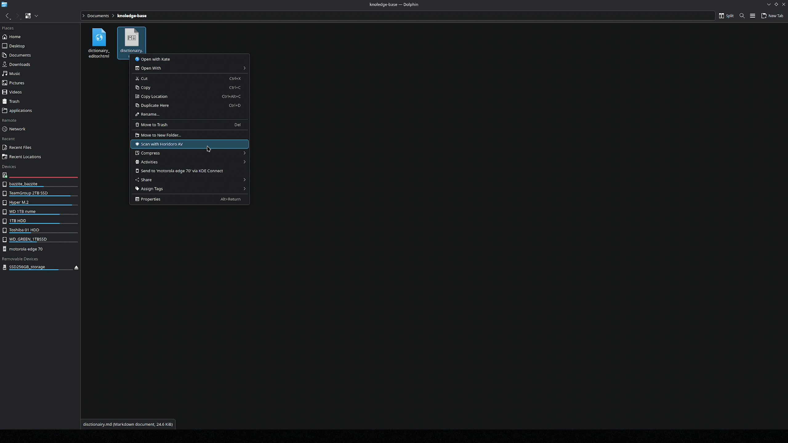
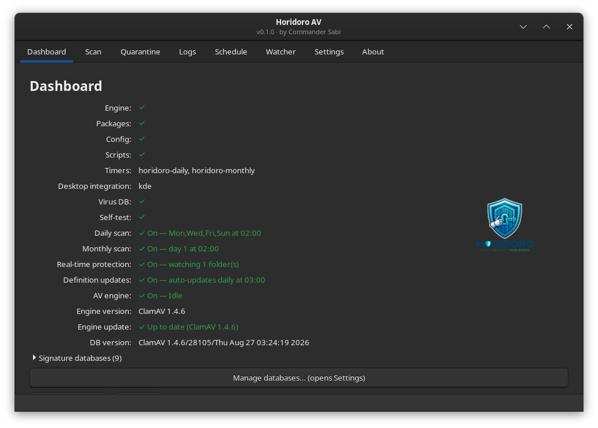
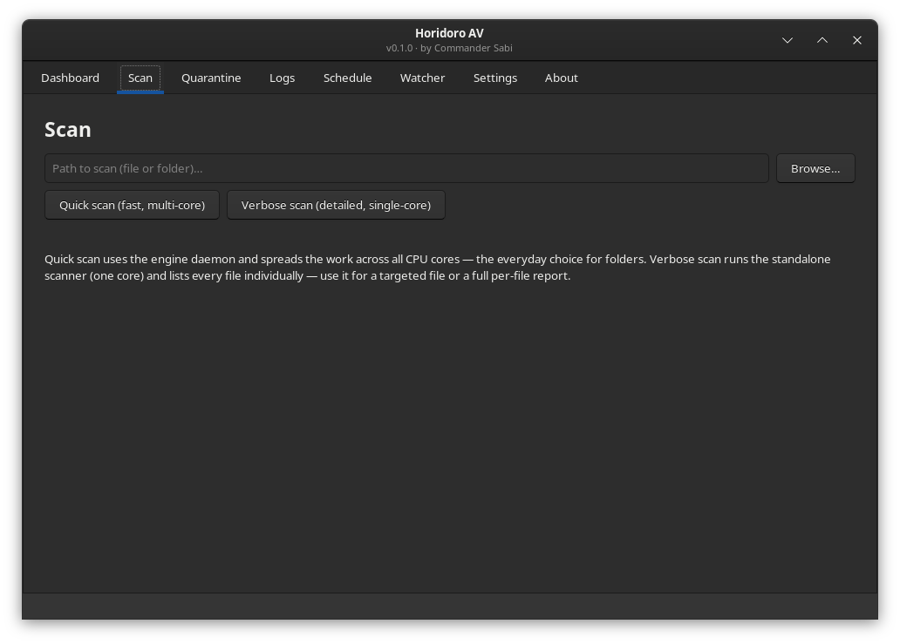
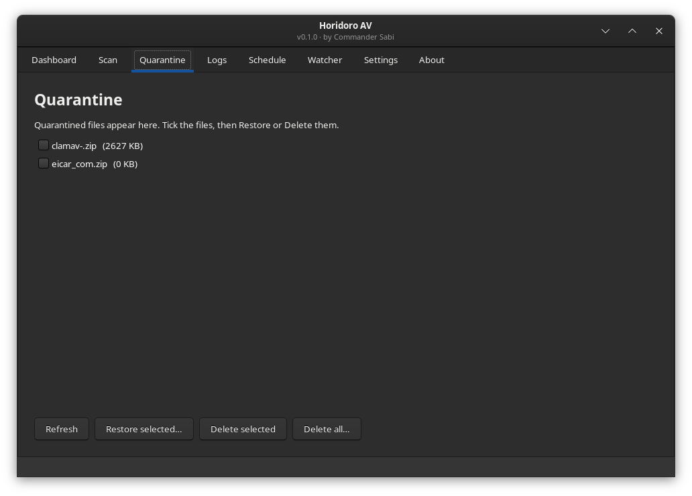
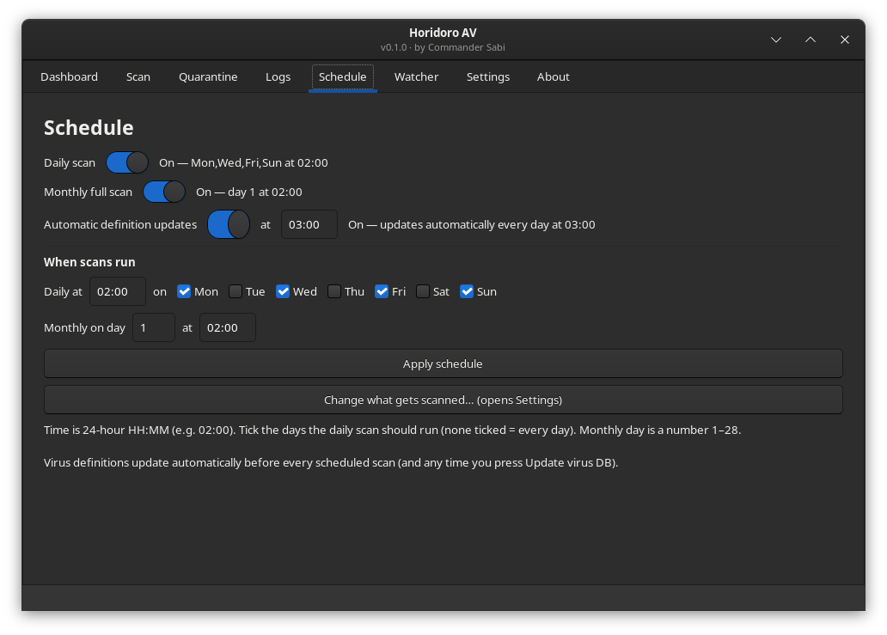
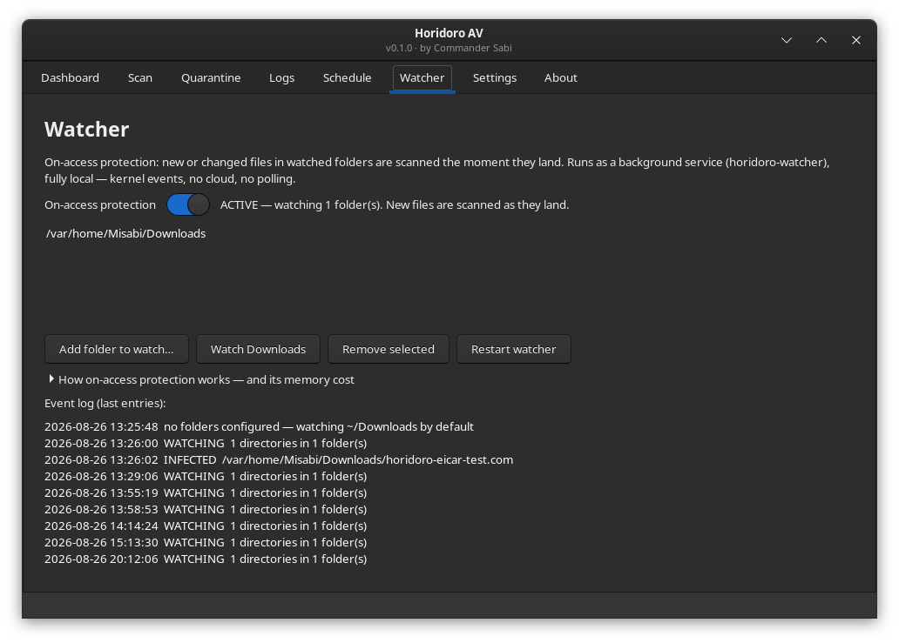
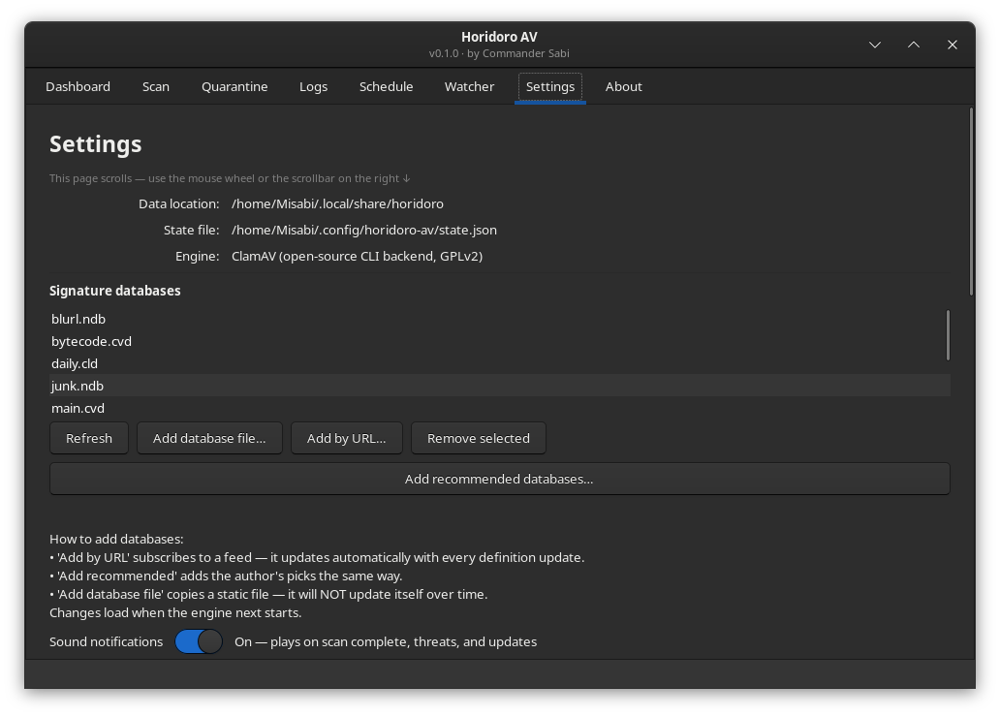
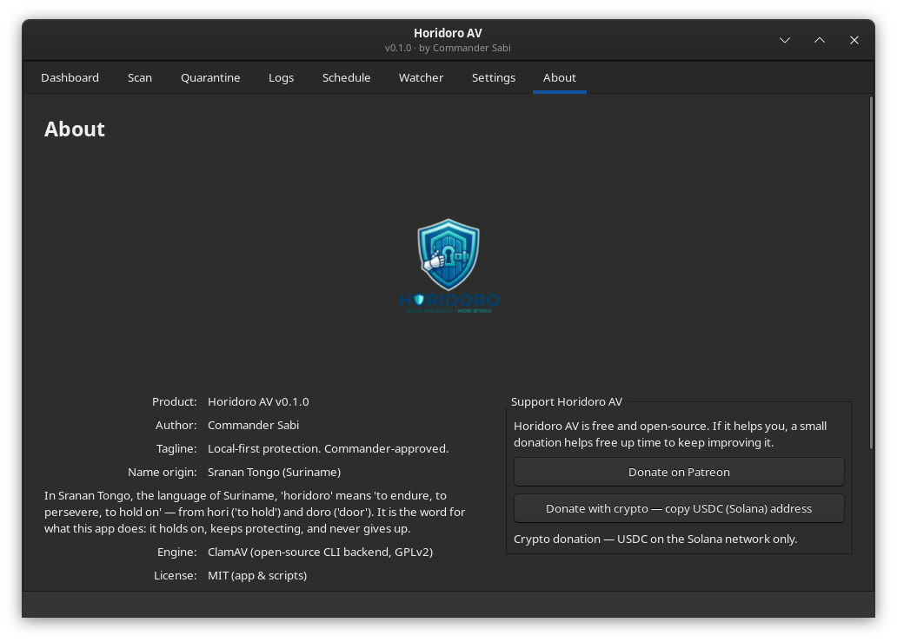

# Horidoro AV

**Local-first protection. Commander-approved.**

**Website:** [horidoro.com](https://horidoro.com)

Horidoro AV is a free, open-source antivirus for Linux that makes protection
simple — especially for people who are new to Linux. One double-click to
install, no terminal, no config files to learn. It protects what you choose,
automatically and quietly, and everything stays on your computer.

The name is Sranan Tongo (the language of Suriname): **horidoro** means **"to endure,
to persevere, to hold on"** — from *hori* ("to hold") and *doro* ("door"). It's
the word for what this app does: it holds on, keeps protecting, and never gives
up.

---

## How it works

Horidoro AV is built on the open-source ClamAV engine — the same signature
technology used by many commercial products — wrapped in a modern local-first
layer:

- **On-access watching** — new files in folders you choose are scanned the
  moment they land (kernel events, no polling).
- **Smart caching** — unchanged files are never rescanned (hash-based).
- **Type-aware scanning** — only meaningful parts are scanned.
- **Per-user automation** — scheduled scans, right-click scanning, full GUI.
- **Complete isolation** — the engine runs inside a container
  (distrobox/podman); nothing touches your host OS.

Everything is 100% local: **no cloud, no account, no data leaves your machine.**

### Honest limitations

- Signature-based detection only — no behavioral engine, no cloud lookups.
- ClamAV's technical limit: files larger than 2 GB are never scanned.
- No kernel-level blocking.
- Not a replacement for commercial protection, and provided as-is with no
  warranty. See [DISCLAIMER.md](DISCLAIMER.md).

## Requirements

- Linux with `systemd` (user services for schedules and on-access protection)
- `python3` with GTK3 bindings (`python3-gobject` / `python3-gi`)
- `distrobox` (the engine runs inside its own container)

## Platform support

Horidoro AV was made for **Fedora Atomic** — the immutable OS family
(Universal Blue: Bazzite, Aurora, Bluefin; Fedora: Silverblue, Kinoite).

**Tested on:** Bazzite and Aurora (both KDE).

**Should work, but not yet verified:** Bluefin (GNOME), Fedora Silverblue
(GNOME), Fedora Kinoite (KDE) — same Atomic base, no extra setup needed.

Other distros are not supported yet.

## Install

Download **`Horidoro-AV-for-You.zip`** from the
[latest release](https://github.com/CommanderSabi/horidoro-av/releases/latest),
extract, and double-click **`Install Horidoro AV.sh`**. If a dialog asks what
to do with the file, choose whatever it offers — "Launch", "Run", or "Run in
Terminal" (the wording varies by desktop). The Horidoro AV window opens;
click **Install**, wait a few minutes, done. From then on it's in your apps
menu.

If the installer tells you something is missing, install it first, e.g.:

```bash
sudo apt install distrobox      # Debian/Ubuntu-based
sudo dnf install distrobox      # Fedora
```

## What you get

| Tab | What it does |
|---|---|
| Dashboard | Engine status, schedules, real-time protection, signature databases |
| Scan | Scan any file/folder (fast multi-core, or detailed single-core) |
| Quarantine | See, restore, or delete quarantined files (multi-select) |
| Logs | Readable scan history |
| Schedule | When daily/monthly scans run — your choice, off by default |
| Watcher | Real-time protection: folders to watch, memory tradeoff explained |
| Settings | Scan targets (one-click quick add), exclusions, signature databases |
| About | The why, the engine credit, the license |

## Screenshots

Here's what Horidoro AV looks like — click any image to view it full size.

**Right-click** — scan any file or folder straight from the file manager


**Dashboard** — engine status, schedules, real-time protection


**Scan** — scan any file or folder


**Quarantine** — see, restore, or delete quarantined files


**Schedule** — when daily/monthly scans run (off by default, your choice)


**Watcher** — real-time protection: folders to watch, memory tradeoff explained


**Settings** — scan targets, exclusions, signature databases, sound notifications


**About** — the why, the engine credit, the license


## Building from source

```bash
python3 build.py          # stitches horidoro/ modules -> horidoro-av.py
python3 run.py            # dev launcher (no build step)
python3 make_dist.py      # builds the shareable zip
python3 tests/test_*.py   # run the test suites
```

## Privacy

100% local. See [PRIVACY.md](PRIVACY.md).

## Security

Reporting issues, false-positive policy, signature updates:
see [SECURITY.md](SECURITY.md).

## Support

Horidoro AV is free and open-source. If it helps you, a small donation
helps free up time to keep improving it.

- **Patreon:** https://www.patreon.com/cw/CommanderSabi
- **Cryptocurrency — USDC (Solana network only):**
  `2stgEZfERUMs7naTjikdR4CkDUnU1gsYKSHCX4VH5DQt`
  (a cryptocurrency payment — send the USDC token on the Solana network
  only; sending it on another network can lose the funds)

## License

Horidoro AV is released under the MIT License. Copyright (c) 2026 Commander
Sabi. Horidoro AV utilizes ClamAV (GPLv2) as an external system engine.
